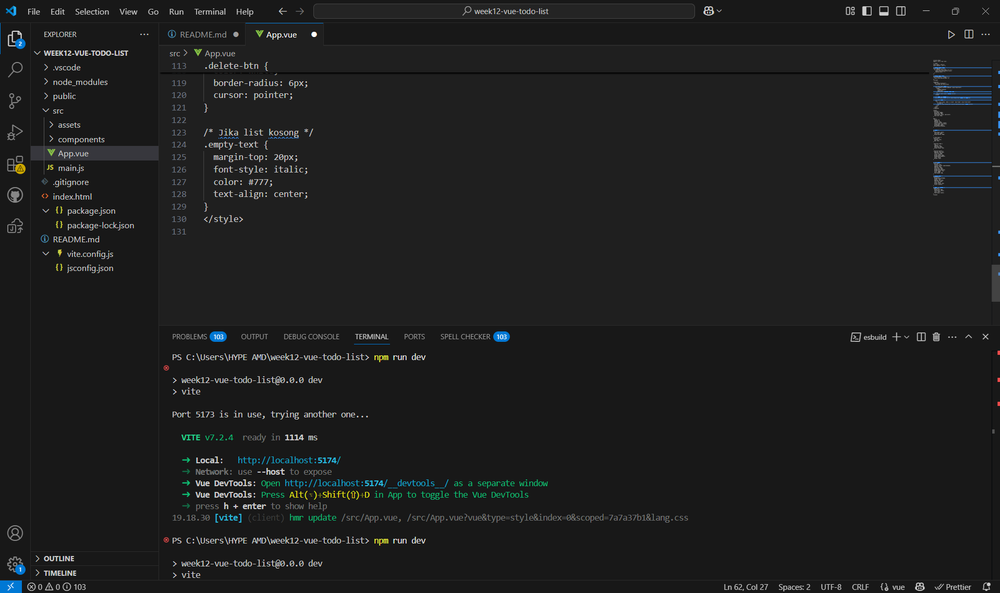
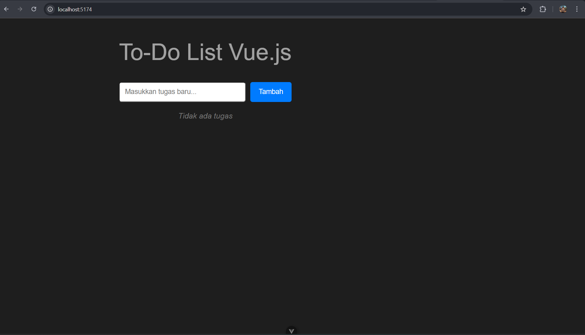
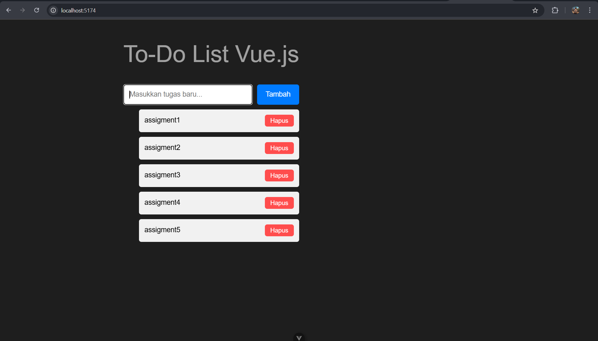

# Assignment4: Vue.js – Simple To-Do List

## Identitas
- Nama : Nurul Fatimah
- NIM  : F1D022085

---

## Deskripsi Tugas 4
Pada assignment ini, saya membuat aplikasi **To-Do List** sederhana menggunakan framework **Vue.js**.  
Aplikasi ini dibangun untuk memenuhi tugas mata kuliah *Pemrograman Web Lanjut*.

Fitur yang dibuat:
- Menambah tugas baru menggunakan form input
- Menghapus tugas tertentu dari daftar
- Menampilkan pesan “Tidak ada tugas” saat daftar masih kosong
- Memanfaatkan reaktivitas `ref()` dari Vue.js
- Menampilkan list tugas secara dinamis dengan `v-for`

---

## Penjelasan Singkat Program
State dibuat menggunakan `ref()`:
- **tasks** menyimpan daftar tugas sebagai array
- **newTask** menangkap input pengguna dari form

Fungsi `addTask()` bekerja dengan menambahkan isi `newTask` ke array `tasks`, lalu mengosongkan input.  
Daftar tugas ditampilkan menggunakan `v-for` dan setiap item memiliki tombol **Hapus** yang memanggil `deleteTask(index)` untuk menghapus tugas berdasarkan index.

---

## Hasil Program
## 1. Run program 


## 2. Tampilan awal 


## 3. Tampilan setelah tambah tugas 


---

## Cara Menjalankan Aplikasi
```bash
npm install
npm run dev
